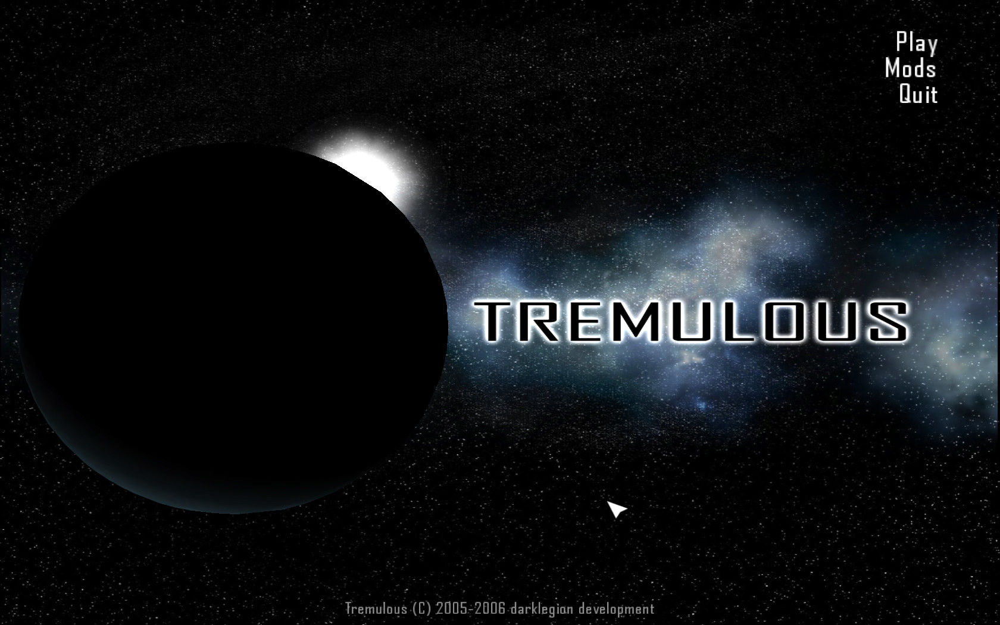
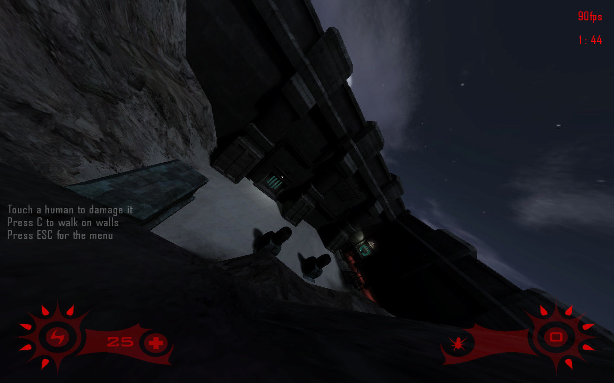
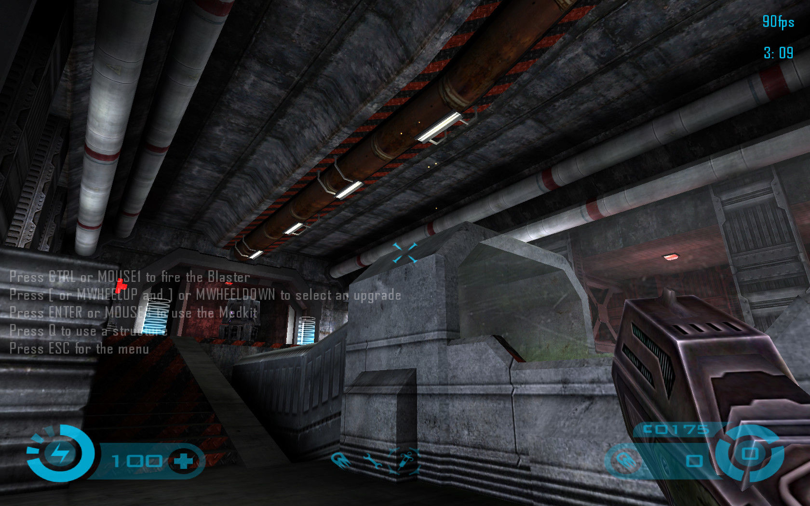
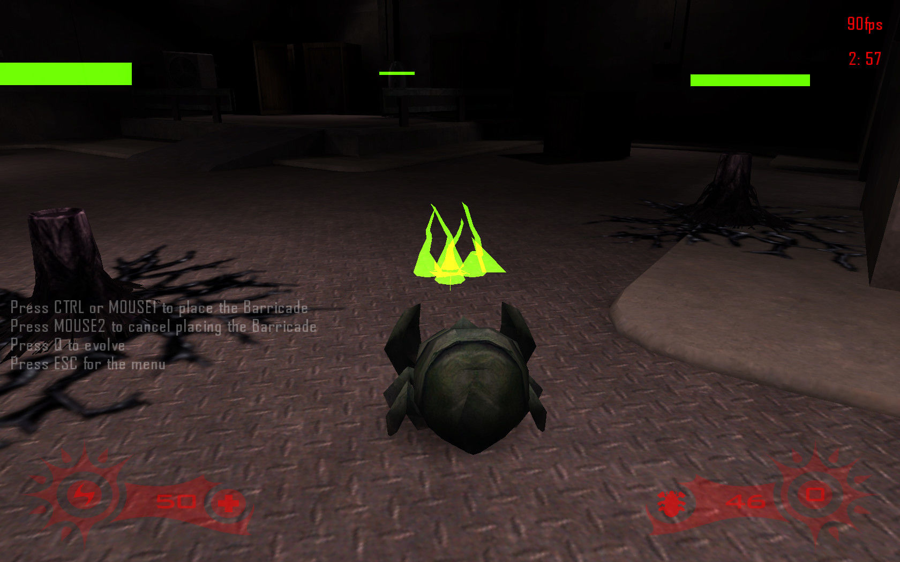

## About

Tremulous is a free and open source asymmetric team-based first-person shooter with real-time strategy elements. The game features two opposing teams: humans and aliens. Each team must attack the enemy's base and team members while defending their own base.

## History

Around 2000, development was started by players of the [Quake II](https://en.wikipedia.org/wiki/Quake_II) modification [Gloom](http://www.planetgloom.com/), which also features alien vs human teams with distinct user classes. Following a long gestation period, Tremulous was originally released as a mod for [Quake III Arena](https://en.wikipedia.org/wiki/Quake_III_Arena) in the summer of 2005. [id software](https://idsoftware.com/) subsequently released the full [source code](https://github.com/ioquake/ioq3) for its game engine and Tremulous transitioned to a fully standalone title over the following months, eventually leading to an initial release in the spring of 2006. A couple of minor patches were made to version 1.1 the game, and some further work was made towards version 1.2. This was released as the Game Play Preview (GPP) patch, though ultimately interest from the original developers waned and the community took over development and maintenance.

## Downloads

The original downloads are still hosted on [Sourceforge](https://sourceforge.net/projects/tremulous/files/tremulous/).
At this point however, Tremulous is obviously very old and there are no doubt better options in terms of clients such as [Tremfusion](https://mirror.kdude63.com/mercenaries_guild/archive/Client_Binaries/TremFusion/) ([source](https://github.com/Amanieu/tremfusion)) or [GrangerHub](https://github.com/GrangerHub/tremulous/tags) ([source](https://github.com/GrangerHub/tremulous)).

The original source code is also [available](https://github.com/darklegion/tremulous).

There is an old [discussion forum](https://forum.tremulous.net/). It doesn't get much traffic, and is mostly up for posterity.

## Credits

The original development team is listed below, although many other people contributed following the open source release.

* Tim Angus: Programming, Direction, Design
* Nick Jansens: Mapping, Texturing, 2D Art
* Robin Marshall: Mapping, Modelling, Animation
* Jan van der Weg: Mapping, Texturing
* Paul Greveson: Modelling, Texturing
* Michael McInerney: Modelling, Texturing, Animation
* Gordon Miller: Mapping
* Who‑[Soup]: Mapping
* Tristan Blease: Mapping
* Chris McCarthy: Sound
* Asa Kravets: QA, Design, Documentation
* Yves Allaire: Texturing
* Randy Reddig: Texturing
